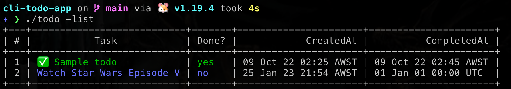

# cli-todo-app



to build the project run `make`

## usage
```
Usage of ./todo:
  -add
        add a new todo
  -complete int
        marked a todo as completed
  -delete int
        deleted a todo
  -list
        list all todos
````

